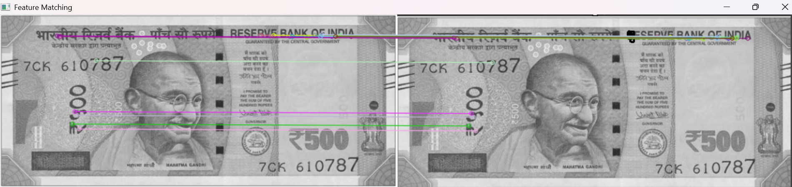

# 💵 Currency Note Detection with OpenCV

This project detects the authenticity of an Indian ₹500 currency note using OpenCV’s feature matching technique.

---

## 🎯 Objective

To simulate a lightweight image processing system that detects fake vs real notes using keypoint similarity and feature descriptors (ORB).

---

## 🧰 Tech Stack

- Python
- OpenCV
- NumPy
- ORB (Oriented FAST and Rotated BRIEF)

---

## 🔧 How It Works

1. A real note image is stored in `reference/`.
2. A test image is placed in `test_images/`.
3. ORB keypoints are extracted and matched.
4. Based on number of matches, the note is classified as:
   - ✅ **Possibly Real**
   - ❌ **Possibly Fake**

---

## 🖼️ Sample Output

---

## ⚠️ Disclaimer

This project is for **educational use only**. It does not replace any official currency verification mechanism.

---

© 2025 Aarush Gupta · MS in Cybersecurity & Privacy
